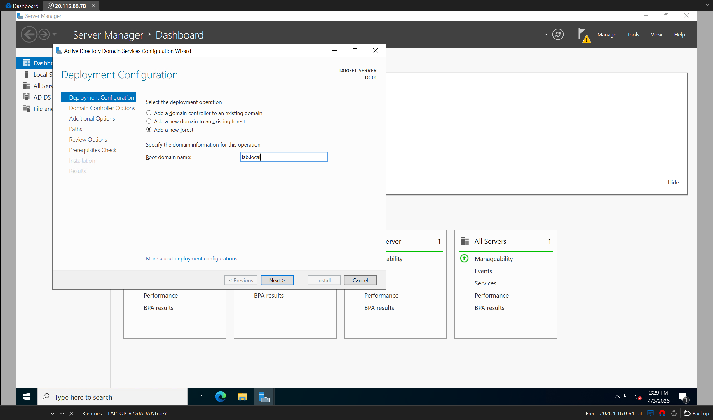
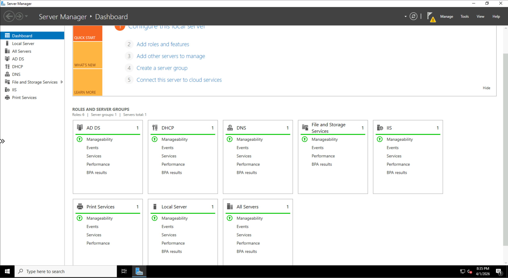
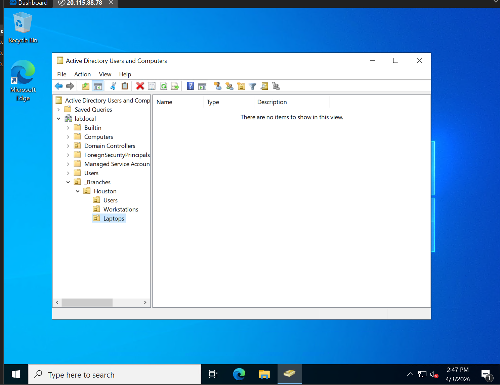
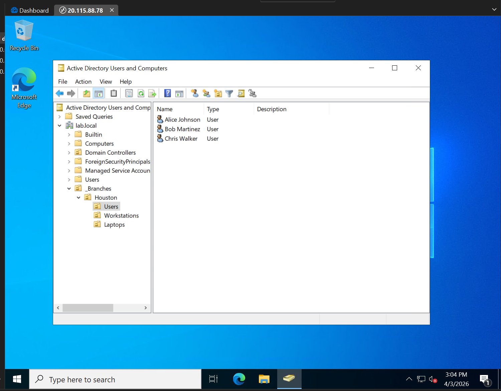
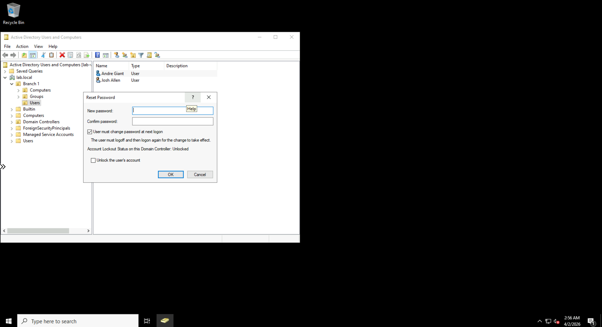
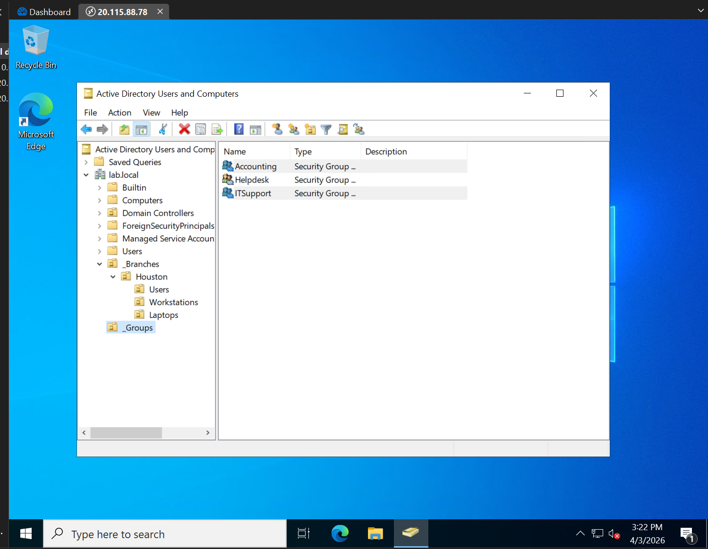
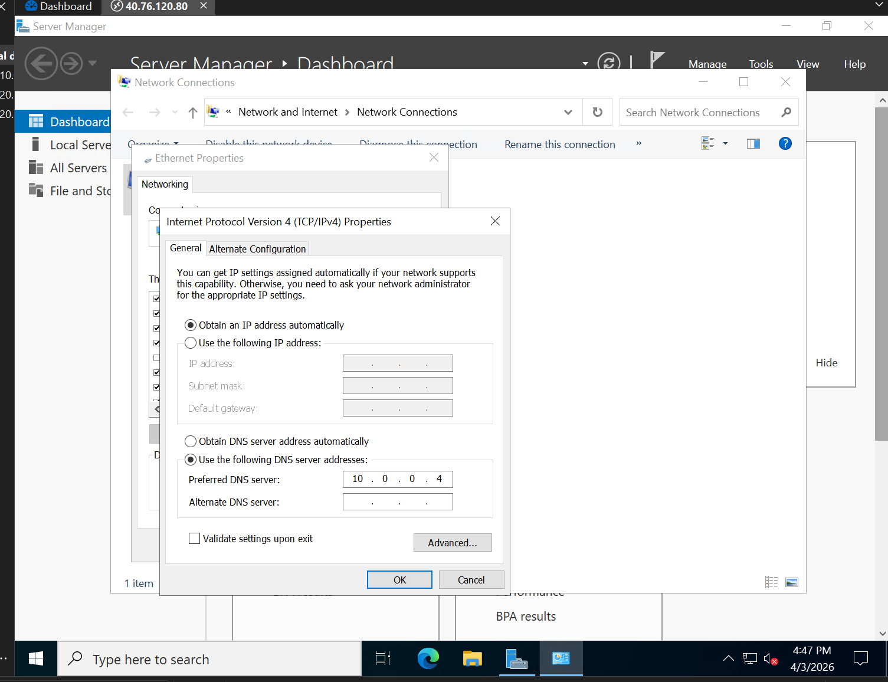
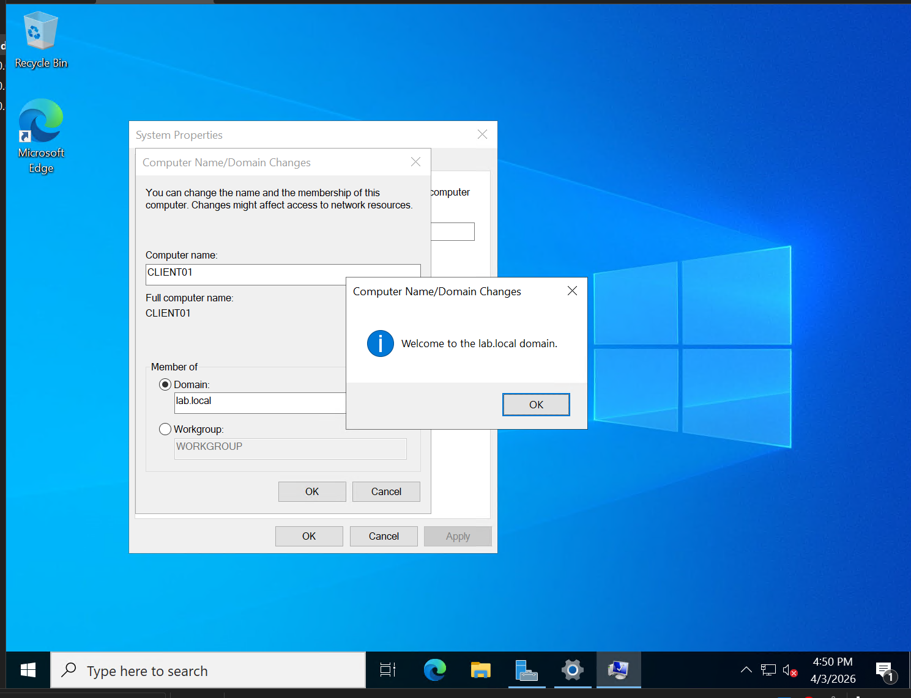
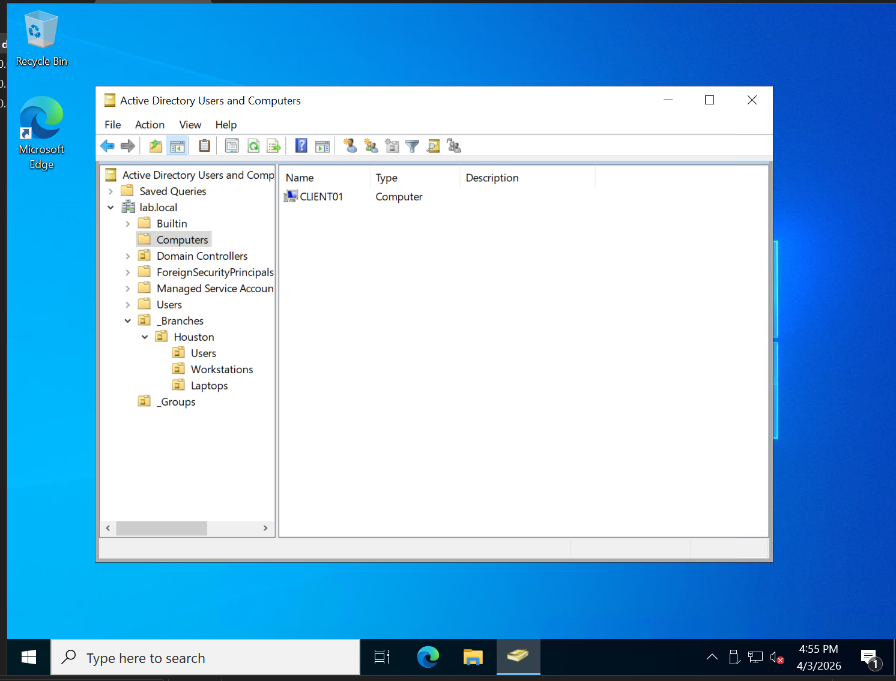

# Tier 1 IT Lab – Active Directory Basics (Microsoft Azure)

## 🎯 Lab Overview

This lab simulates real-world Tier 1 help desk tasks using a **Windows Server** virtual machine deployed in **Microsoft Azure**. The focus is on **Active Directory Domain Services (AD DS)** – a core skill for user management, password resets, and domain-joined computer support.

> I have no formal IT experience, so I built this lab to demonstrate hands-on skills. All work is documented below with screenshots and a help desk ticket simulation.

---

## ☁️ Lab Environment

| Component | Technology |
|-----------|------------|
| **Cloud Platform** | Microsoft Azure |
| **Virtual Machine** | Windows Server 2022 Datacenter (Azure VM) |
| **Role Installed** | Active Directory Domain Services (AD DS) |
| **Domain Name** | `lab.local` (or your chosen name) |
| **Admin Tools** | Active Directory Users and Computers (ADUC), PowerShell, Azure Portal |
| **Connectivity** | RDP over Azure NSG (port 3389 restricted to my IP) |

---

## 📸 Lab Task Screenshots

| Task | Screenshot |
|------|------------|
| Adding forest (promote to Domain Controller) |  |
| Installing AD DS roles & features |  |
| Creating Organizational Units (OUs) |  |
| Adding users to OUs |  |
| Resetting a user password |  |
| Adding security groups |  |
| Domain join – step 1 of 3 |  |
| Domain join – step 2 of 3 |  |
| Domain join – step 3 of 3 |  |
---

## 🧠 What I Learned

- How to install and promote a Windows Server to a Domain Controller
- Navigating **Active Directory Users and Computers (ADUC)**
- Creating OUs and organizing users for group policy application
- Resetting passwords and unlocking accounts – the #1 Tier 1 ticket
- Basic DNS role of a DC (client domain join depends on it)
- Cost awareness: deallocated the Azure VM after lab sessions

---

## 📄 Sample Help Desk Ticket

**Ticket #101**  
**Issue:** User calls – "I forgot my domain password and now my account is locked."  
**Action Taken:**  
1. Logged into DC via RDP  
2. Opened ADUC → Found user in `IT` OU  
3. Right-click → Reset password (set temp `P@ssw0rd123`)  
4. Checked "Unlock account" checkbox  
5. Instructed user to log in with temp password and change it  
**Resolution:** User successfully logged in. Ticket closed.  
**Time:** 8 minutes

*More tickets in [`LAB-REPORT.md`](LAB-REPORT.md)*

---

## 🧹 Cost Management

- Azure VM size: **B1s** (eligible for free tier / low cost)
- Lab duration: ~3 hours total
- VM **deallocated** after each session to stop billing
- Total estimated cost: < $1 (or $0 with Azure credits)

---

## 🔗 Lab Reference

This lab was completed following the guide at:  
[Jake's Tech Labs – AD Basics](https://jakestechlabs.com/labs/ad-basics/step-1)

All screenshots and configurations are my own work, adapted for a cloud environment (Microsoft Azure instead of on-premises Hyper-V).

---

## 🚀 Why This Matters for a Tier 1 Role

- ✅ Active Directory is used by **90%+ of businesses** – this is directly transferable
- ✅ Using Azure shows **cloud familiarity** (many companies use Azure AD / Entra ID)
- ✅ Documentation proves I can **communicate technical steps** clearly
- ✅ Cost management shows **responsibility** with company resources

---

*Last updated: April 2026*  
*Portfolio lab – no professional experience yet, but building skills daily.*
