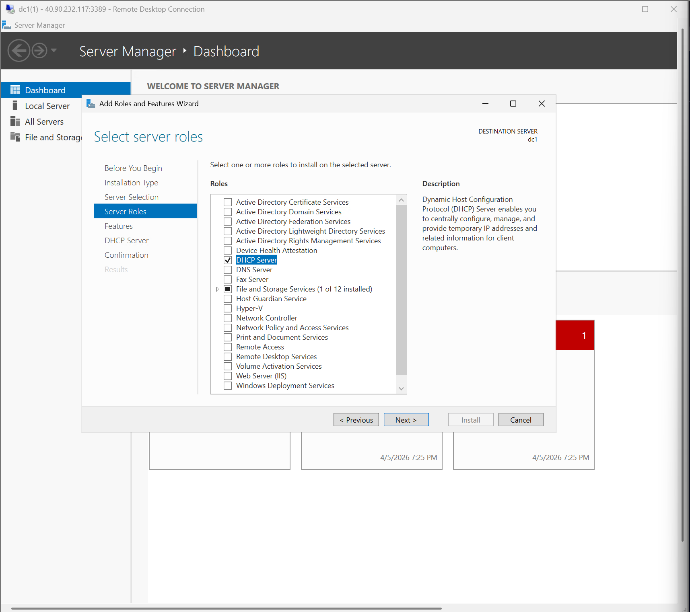
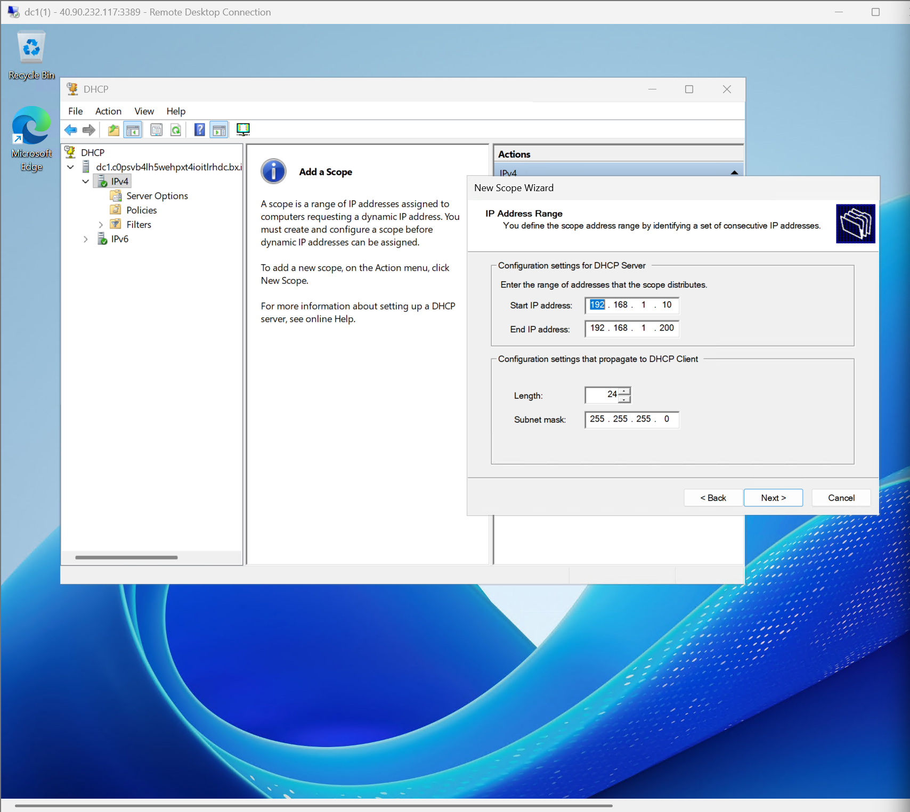
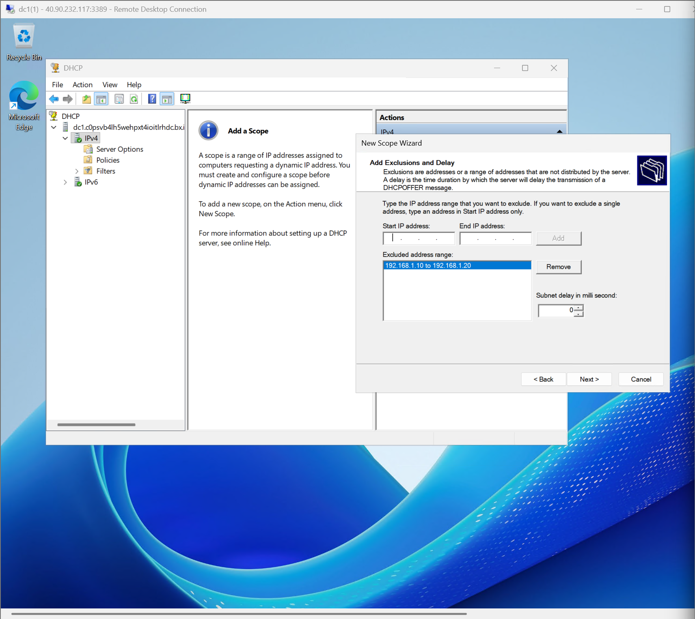
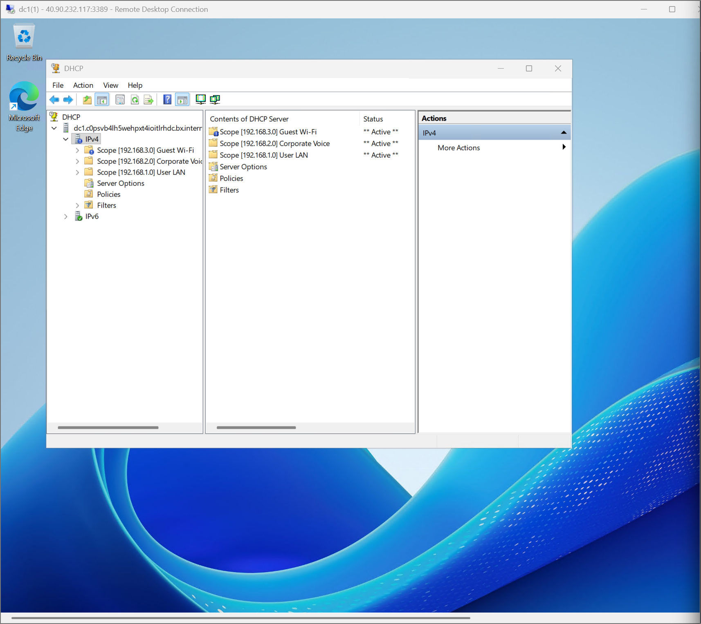
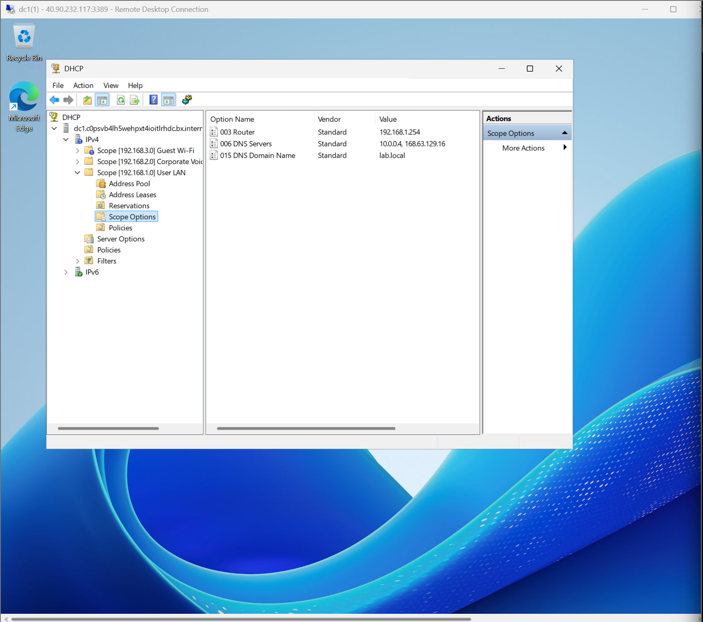
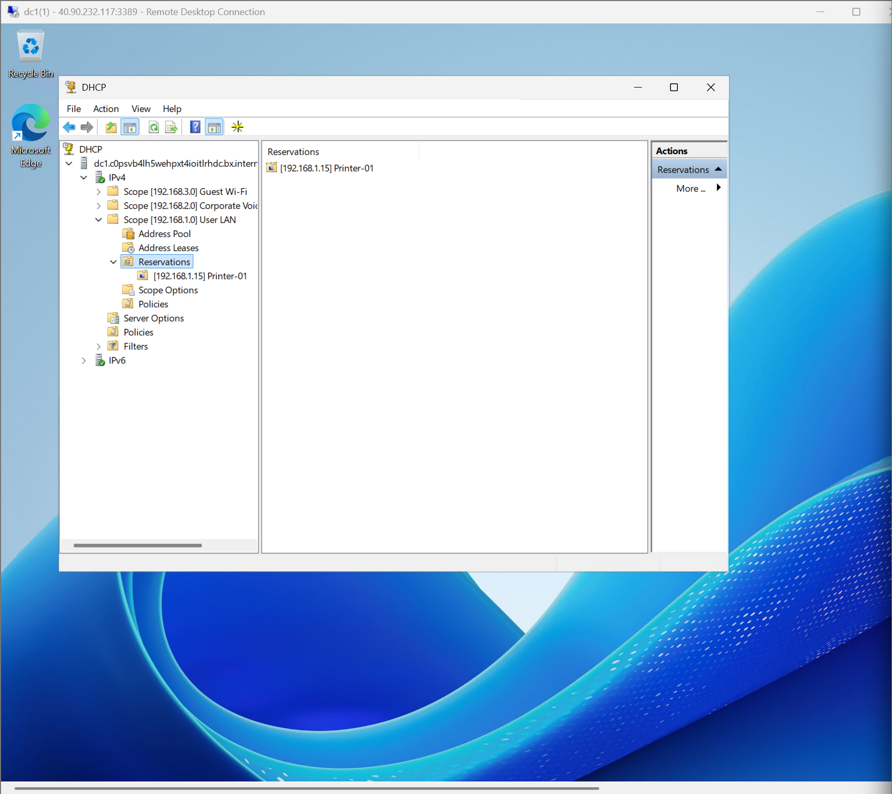

# Tier 1 IT Lab – DHCP Server Configuration (Microsoft Azure)

## 🎯 Lab Overview

This lab builds on my Active Directory environment. After setting up the domain controller, I installed and configured the **DHCP Server** role. DHCP (Dynamic Host Configuration Protocol) automatically assigns IP addresses to devices on the network – a critical service for any organization.

> This lab demonstrates my understanding of networking fundamentals and automated IP management, a key responsibility for many Tier 1 and Tier 2 roles.

---

## ☁️ Lab Environment

| Component | Technology |
|-----------|------------|
| **Cloud Platform** | Microsoft Azure |
| **Virtual Machine** | Windows Server 2022 Datacenter (Azure VM) |
| **Server Role** | DHCP Server |
| **Domain** | `lab.local` |
| **Network Configuration** | Azure Virtual Network (VNet) with static IP for DC |

---

## 📸 Lab Task Screenshots

| Task | Screenshot |
|------|------------|
| Installing DHCP Server role via Server Manager |  |
| Creating a new IPv4 scope (IP range, subnet mask) |  |
| Configuring exclusion range within the scope |  |
| Viewing established / active scopes |  |
| Configuring scope‑specific options (Gateway, DNS, etc.) |  |
| Setting up DHCP reservations for specific devices |  |

---

## 🧠 What I Learned

- How to install and authorize the DHCP Server role in an Active Directory domain
- Creating a DHCP scope: IP range, subnet mask, lease duration, exclusions
- Configuring essential scope options like `003 Router` (Default Gateway) and `006 DNS Servers`
- Understanding the purpose of DHCP reservations for static‑IP devices (printers, servers)
- Troubleshooting client‑side issues with `ipconfig /release` and `ipconfig /renew`
- The four‑step DHCP process (DORA: Discover, Offer, Request, Acknowledge)

---

## 📄 Sample Help Desk Ticket

**Ticket #102**  
**Issue:** User reports a "Limited or no connectivity" error and an IP address starting with `169.254.x.x` (APIPA).  
**Action Taken:**  
1. Confirmed the DHCP server service is running on the domain controller.  
2. Checked the DHCP console to ensure the scope was active and had available IP addresses.  
3. On the user's machine, ran `ipconfig /release` followed by `ipconfig /renew` in Command Prompt.  
4. Verified the client received a valid IP address from the correct scope.  
**Resolution:** User's network connectivity was restored. Ticket closed.  
**Time:** 10 minutes

---

## 🔗 Lab Reference

This lab was completed following the guide at:  
[Jake's Tech Labs – DHCP](https://jakestechlabs.com/labs/dhcp)

All screenshots and configurations are my own work in a Microsoft Azure environment.

---

## 🚀 Why This Matters for a Tier 1 Role

- ✅ DHCP is the backbone of any modern network – understanding it is non‑negotiable for IT support.
- ✅ Demonstrates ability to set up and manage **critical network services** beyond just user accounts.
- ✅ The `ipconfig /renew` command is one of the most common **troubleshooting steps** for Tier 1 help desk.
- ✅ Shows I can extend a basic AD lab into a more complete and realistic **corporate network environment**.
