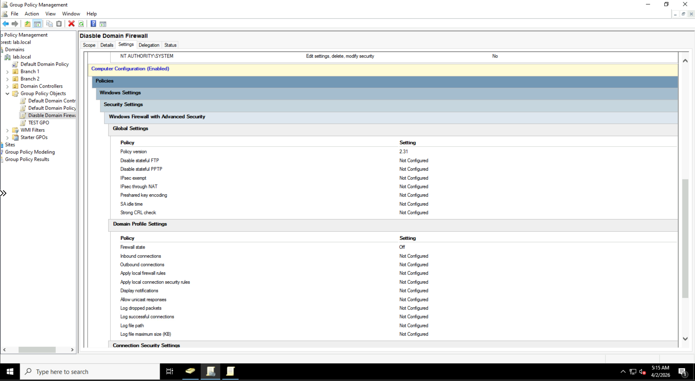
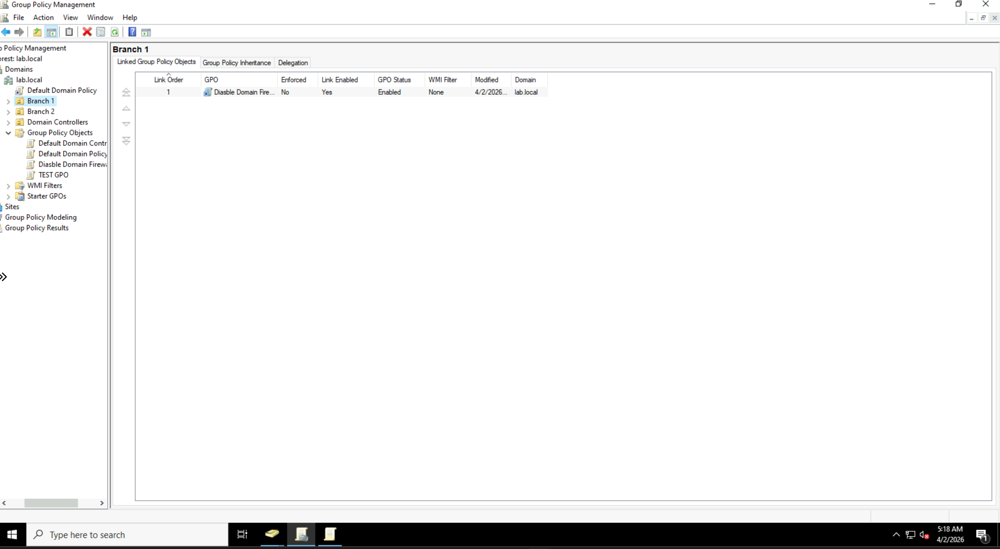
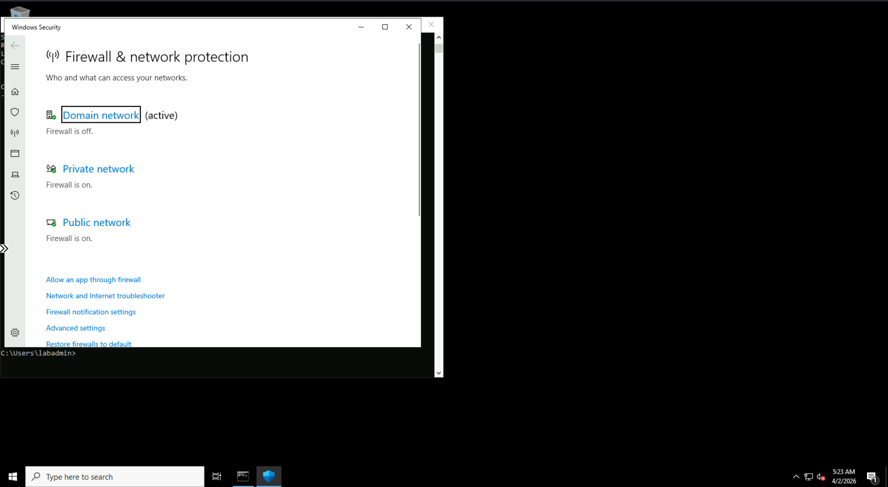
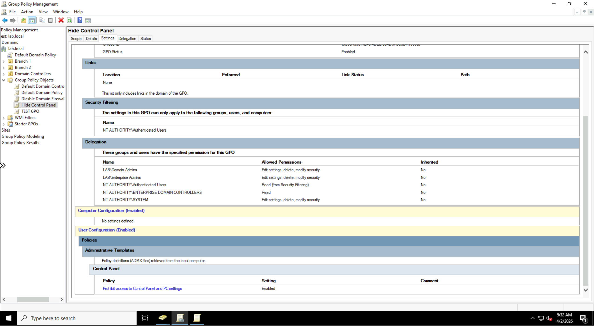
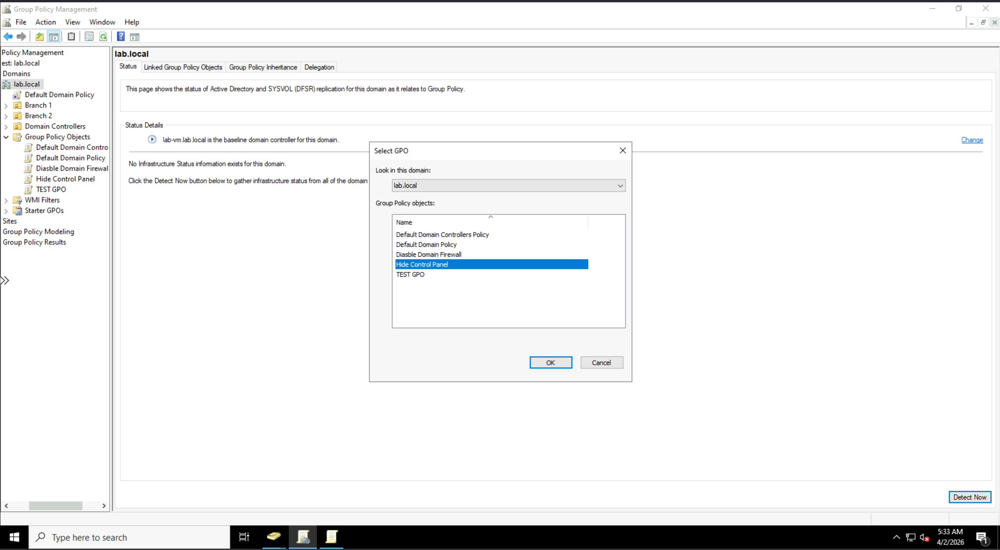
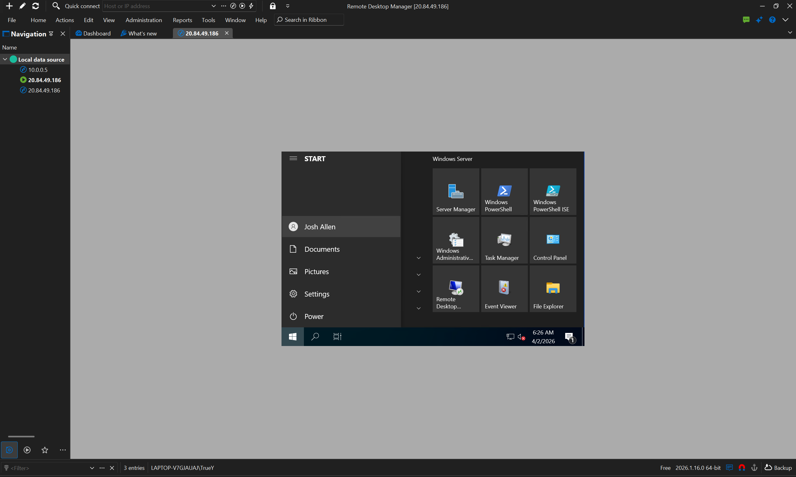
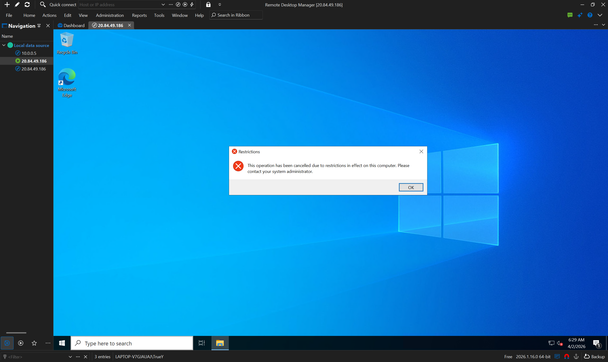
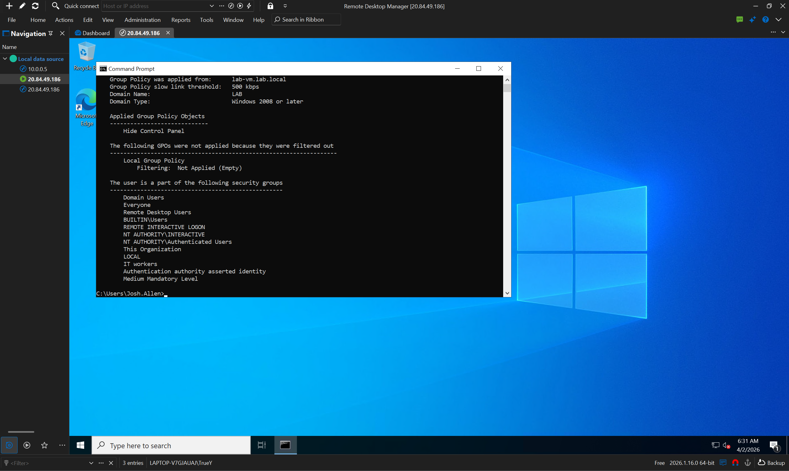

# Tier 1 IT Lab – Group Policy Basics (Microsoft Azure)

## 🎯 Lab Overview

This lab builds on my Active Directory environment to implement **Group Policy Objects (GPOs)**. Group Policy centralizes user and computer configuration management – a critical skill for enforcing security standards and streamlining IT support.

> I have no formal IT experience, so this lab demonstrates my ability to manage policies that affect multiple users and computers in a domain.

---

## ☁️ Lab Environment

| Component | Technology |
|-----------|------------|
| **Cloud Platform** | Microsoft Azure |
| **Virtual Machine** | Windows Server 2022 Datacenter (Azure VM) |
| **Domain** | `lab.local` |
| **Management Console** | Group Policy Management Console (GPMC) |
| **Target OUs** | Created in the AD Basics lab (e.g., `IT`, `HR`) |

---

## 📸 Lab Task Screenshots

| Task | Screenshot |
|------|------------|
| Setting up a new Group Policy Object (GPO) |  |
| Linking the GPO to an Organizational Unit (OU) |  |
| Verifying the GPO is applied (gpresult / filtering) |  |
| Viewing domain-level GPOs |  |
| Linking a GPO directly to the domain level |  |
| User configuration section within a GPO |  |
| Testing GPO application on a client (step 1) |  |
| Final verification – GPO successfully applied |  |

---

## 🧠 What I Learned

- How to create and edit Group Policy Objects (GPOs) in the Group Policy Management Console (GPMC)
- The difference between **Computer Configuration** and **User Configuration** settings
- How to **link GPOs** to specific OUs (e.g., IT, HR) or to the entire domain
- Using `gpupdate /force` and `gpresult /r` to verify policy application
- How Group Policy enables centralized management – changing a setting once applies to hundreds of users

---

## 📄 Sample Help Desk Ticket

**Ticket #103**  
**Issue:** Help desk receives multiple reports that users in the Sales department cannot see a company desktop shortcut that should appear for everyone.  
**Action Taken:**  
1. Logged into the Domain Controller.  
2. Opened Group Policy Management Console (GPMC).  
3. Found the existing GPO named "Company Desktop Settings".  
4. Verified the GPO was linked to the Sales OU (it was).  
5. Edited the GPO → User Configuration → Preferences → Windows Settings → Shortcuts.  
6. Corrected the shortcut path (a typo in the network location).  
7. Ran `gpupdate /force` on a test client and had the user sign out and back in.  
**Resolution:** The desktop shortcut appeared correctly. Ticket closed.  
**Time:** 15 minutes

---

## 🔗 Lab Reference

This lab was completed following the Group Policy sections of:  
[Jake's Tech Labs – AD Basics](https://jakestechlabs.com/labs/ad-basics)

All screenshots and configurations are my own work in a Microsoft Azure environment.

---

## 🚀 Why This Matters for a Tier 1 Role

- ✅ Group Policy is how organizations enforce security (passwords, lockout policies) and standardize user environments (drive maps, shortcuts).
- ✅ Troubleshooting GPO application (`gpresult`, `gpupdate`) is a frequent Tier 2 / Tier 1.5 task.
- ✅ This lab proves I understand **Active Directory structure** beyond just creating users.
- ✅ Shows I can manage **policies that affect hundreds of users** – a step above basic help desk.
